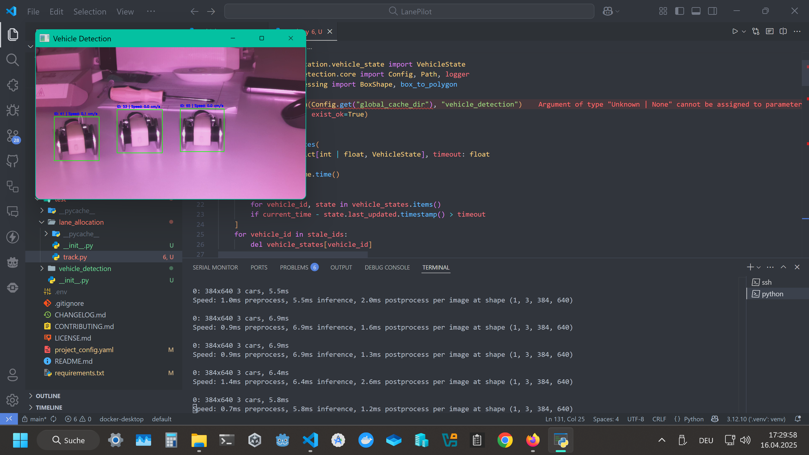

<div align="center">


# `LanePilot 🚗`


[](https://github.com/AppSolves/LanePilot/stargazers)
[](https://github.com/AppSolves/LanePilot/network/members)

<h4><code>LanePilot</code> is an AI-powered system that dynamically optimizes traffic flow by analyzing lane utilization and congestion patterns in real time.
<br>
It ensures efficient lane allocation to reduce bottlenecks and improve overall road efficiency.
<br><br>

[Introduction](#introduction-) • [Features](#features-) • [Installation](#installation-%EF%B8%8F) • [Usage](#usage-) • [Customization](#customization-) • [Credits](#credits-) • [License](#license-)

</div>
<br>

# LanePilot 🤖

## Introduction 📖
Welcome to **LanePilot**!

LanePilot is an advanced AI-based traffic management system designed to analyze real-time lane usage and congestion, enabling dynamic lane allocation and smarter traffic flow. By leveraging computer vision and deep learning, LanePilot helps reduce bottlenecks, minimize CO₂ emissions, improve road safety, and optimize urban mobility.

For more information, please view the [documentation](Documentation.pdf) (written in German).

## Features 🚀
- [x] **Real-Time Lane Detection:** Uses AI and computer vision to detect lanes, vehicles, and congestion in real-time.
- [x] **Dynamic Lane Allocation:** Automatically suggests or controls lane assignments to optimize traffic flow.
- [x] **Modular Integration:** Easily integrates with existing traffic infrastructure and IoT devices.
- [x] **Data Logging & Visualization:** Stores and visualizes traffic data for analysis and reporting.

- **Not implemented yet**:
    - [ ] **Vehicle Classification:** Identifies vehicle types (e.g., cars, trucks, buses) for tailored traffic management.
    - [ ] **Customizable Alerts:** Notifies operators or drivers about incidents, congestion, or recommended actions.
    - [ ] **Congestion Analysis:** Analyzes traffic patterns and congestion levels to provide insights for urban planners.

<br>
<kbd>  </kbd>

## Installation 🛠️

### Binaries & Packages 📦
If you prefer not to build from source, pre-built binaries and packages are available for various platforms. Check the [releases](https://github.com/AppSolves/LanePilot/releases) page for the latest versions or run the following commands to download the latest docker images:

- Raspberry Pi:
```bash
curl -sSL https://raw.githubusercontent.com/AppSolves/LanePilot/refs/heads/main/scripts/compose.sh | bash -s raspberrypi
```

- NVIDIA Jetson:
```bash
curl -sSL https://raw.githubusercontent.com/AppSolves/LanePilot/refs/heads/main/scripts/compose.sh | bash -s jetson
```

### Build from Source 🔨

1. **Clone the Repository:**  
   Clone the repository to your local machine:
   ```bash
   git clone https://github.com/AppSolves/LanePilot.git
   ```

2. **Install Dependencies:**  
   Navigate to the root directory and install the required libraries:
   ```bash
   python -m venv venv
   # On Windows:
   venv\Scripts\activate
   # On Unix/Mac:
   source venv/bin/activate
   pip install -r requirements.txt
   ```

3. **Install Additional Tools (if needed):**  
   - **Docker:** [Download here](https://www.docker.com/products/docker-desktop) and follow the installation instructions.
   - **CUDA, including cuDNN and TensorRT:** For GPU acceleration, install the appropriate CUDA version for your GPU. Follow the [NVIDIA installation guide](https://docs.nvidia.com/cuda/cuda-installation-guide-linux/index.html) for your OS.

4. **Build Docker Images:**  
   If you wish to build manually, run the `scripts/build_opencv.sh` and `scripts/compose.sh` scripts:
   ```bash
   chmod +x scripts/*.sh # Make all helper scripts executable
   ./scripts/build_opencv.sh # Build the OpenCV image (arm64 only)
   ./scripts/compose.sh [<platform>]
   ```

> [!IMPORTANT]
> The Jetson image (more precisely, the `opencv_base` image) is built **without** the NVIDIA Video Codec SDK (`cudacodec` support).
> This is due to licensing issues with NVIDIA.
> If you need `cudacodec` support, please follow the instructions in the relevant [Dockerfile](opencv/Dockerfile.opencv) and build the image locally using the provided Dockerfile.

## Customization 🎨

LanePilot is modular and configurable:
- **Detection Models:** Swap or retrain detection models in the `models/` directory.
- **Alerts & Actions:** Customize alert logic in the `common/` or `utils/` modules.
- **Configuration Files:** Edit the `config.yaml` files in submodules to adjust settings like model parameters, thresholds, and camera feeds.

## Usage 📝
Running LanePilot is as simple as running `docker compose` on your platform/device:

   ```bash
   scripts/compose.sh [<platform>] # Done ✨
   ```

## Credits 🙏
This project was developed and is maintained by [AppSolves](https://github.com/AppSolves).

#### Links

- [E-Mail](mailto:contact@appsolves.dev)
- [Website](https://appsolves.dev)
- [GitHub](https://github.com/AppSolves)
- [Instagram](https://www.instagram.com/appsolves.dev/)
- [This Repository](https://github.com/AppSolves/LanePilot)

## License 📜
This project is licensed under a custom license with **All Rights Reserved**.  
No use, distribution, or modification is allowed without explicit permission from the author.

For more information, please see the [LICENSE.md](LICENSE.md) file.

LanePilot © 2025 by Kaan Gönüldinc

## Conclusion 🎉

Thank you for checking out LanePilot! We hope you find this tool useful for smart traffic management and urban mobility. For questions, feedback, or suggestions, please reach out to us.